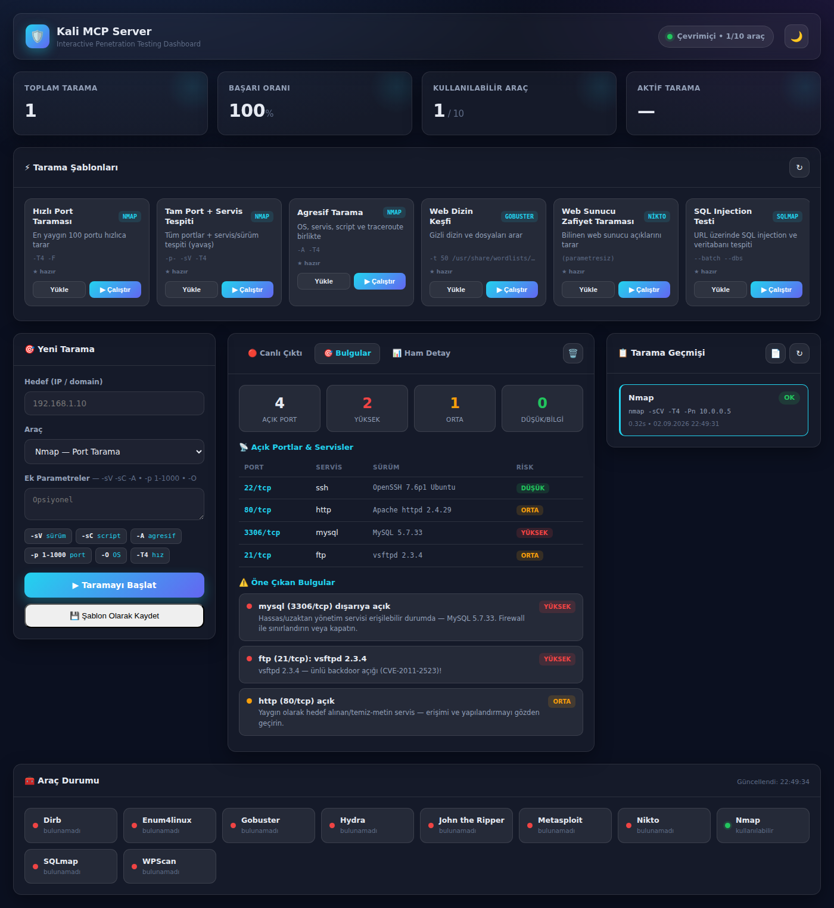

# 🛡️ Kali MCP Server

> An interactive penetration-testing dashboard and **Model Context Protocol (MCP)** server that wraps common Kali Linux security tools behind a clean web UI and an AI-agent-ready API.

<p align="center">
  
</p>

Kali MCP Server turns a set of command-line security tools (nmap, sqlmap, gobuster, nikto, hydra, and more) into a single, modern application. You can drive scans from a real-time web dashboard **or** expose the same tools to an AI assistant through MCP — the raw tool output is parsed into structured, risk-rated findings and can be exported to a professional PDF report.

---

## ✨ Features

- **Unified single-server architecture** — the backend serves the REST API, the WebSocket stream, and the dashboard UI from one origin (port `5001`).
- **Real-time scan streaming** — live stdout/stderr in the browser over WebSockets, with a progress bar and a working **cancel** button that terminates the whole process group (not just the shell).
- **Structured findings** — raw output from nmap / nikto / gobuster / dirb / sqlmap is parsed into open-ports tables and risk-rated findings (high / medium / low / info).
- **Scan templates** — 8 built-in templates plus your own saved configurations, with one-click launch.
- **PDF reports** — per-scan and summary reports with a branded layout, findings section, and full Unicode (Turkish) support.
- **Modern UI** — responsive dashboard with a light/dark theme toggle and a live tool-availability panel.
- **MCP integration** — the same tools are exposed to AI agents (e.g. Claude Desktop) via the Model Context Protocol.
- **Per-tool scan history** — every scan is stored in SQLite, searchable and re-openable.

## 🧰 Supported Tools

| Category | Tools |
|----------|-------|
| Reconnaissance | Nmap, Enum4linux |
| Web | Gobuster, Dirb, Nikto, SQLmap, WPScan |
| Exploitation | Metasploit |
| Credential attacks | Hydra, John the Ripper |

## 🚀 Quick Start

> Requires **Python 3.8+** running on **Kali Linux** (or any host with the tools installed). Use `python3` / `pip3` — not the legacy Python 2 `pip`.

```bash
# 1. (recommended) create a virtual environment
python3 -m venv .venv
source .venv/bin/activate

# 2. install dependencies
pip install -r requirements.txt
# on newer Kali without a venv, use: pip install -r requirements.txt --break-system-packages

# 3. run the server (serves API + WebSocket + dashboard)
python3 src/backend/kali_server.py --port 5001 --ip 0.0.0.0
```

Then open the dashboard at **http://127.0.0.1:5001/**

## ⚙️ Configuration

Set via environment variables (see [`.env.example`](.env.example)):

| Variable | Default | Description |
|----------|---------|-------------|
| `API_PORT` | `5001` | Server port |
| `API_IP` | `127.0.0.1` | Bind address (`0.0.0.0` for LAN access) |
| `DATABASE_PATH` | `scan_history.db` | SQLite scan-history database |
| `COMMAND_TIMEOUT` | `180` | Per-command timeout in seconds |
| `TOOL_STATUS_CACHE_TTL` | `60` | Tool-availability cache lifetime (s) |
| `CORS_ORIGINS` | `*` | Allowed CORS origins |
| `SECRET_KEY` | *(dev key)* | Flask secret — **change in production** |

## 🏗️ Architecture

```
┌──────────────────────────────────────────────┐
│         kali_server.py  (port 5001)           │
│  ┌────────────┐  ┌───────────┐  ┌──────────┐  │
│  │  REST API  │  │ WebSocket │  │  Static  │  │
│  │  /api/...  │  │ (Socket.IO)│ │   UI     │  │
│  └─────┬──────┘  └─────┬─────┘  └────┬─────┘  │
│        │  CommandExecutor (streams)  │        │
│        └───────────┬─────────────────┘        │
│         SQLite (per-tool scan history)        │
│         findings.py (output → findings)       │
└──────────────────────┬───────────────────────┘
                       │  runs
              Kali Linux tools (nmap, sqlmap, …)

   mcp_server.py  ── exposes the same tools to AI agents (MCP)
```

## 📁 Project Structure

```
kalimcp/
├── src/
│   ├── backend/
│   │   ├── kali_server.py      # Main unified server (run this)
│   │   ├── mcp_server.py       # MCP integration for AI agents
│   │   ├── findings.py         # Parses raw output → structured findings
│   │   ├── migration.py        # DB schema migration helper
│   │   └── static/             # Dashboard UI (HTML + local Socket.IO)
│   └── tests/                  # Test suite
├── docs/                       # Documentation & screenshots
├── scripts/                    # Startup scripts
├── requirements.txt
├── .env.example
└── LICENSE
```

## 🤖 MCP Usage

`src/backend/mcp_server.py` exposes each tool as an MCP tool (e.g. `nmap_scan`, `sqlmap_scan`, `hydra_attack`). Point an MCP-capable client (such as Claude Desktop) at it and let the agent orchestrate scans against the running API server.

## ⚠️ Legal & Ethical Notice

This project is intended for **authorized security testing and educational purposes only**. Scanning or attacking systems you do not own or have explicit written permission to test is illegal in most jurisdictions. The authors accept no liability for misuse. Always operate within a controlled lab or an engagement with a signed scope.

## 🛠️ Tech Stack

Python · Flask · Flask-SocketIO · SQLAlchemy (SQLite) · ReportLab · vanilla JS + Socket.IO

## 📄 License

Released under the terms in [LICENSE](LICENSE).
